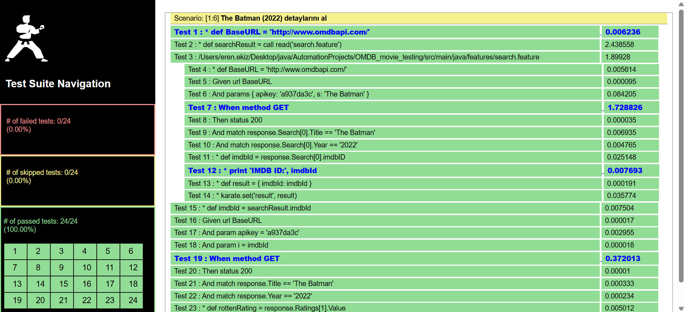
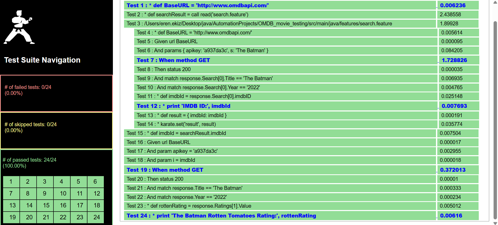
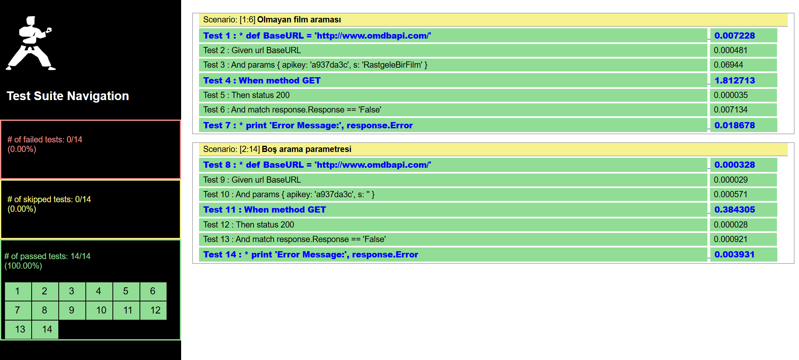

# OMDB API Test Raporları

Aşağıdaki raporlar Karate ile yapılan API testlerinin sonuçlarını göstermektedir.  

---

## 1. The Batman (2022) Arama Testi

- Bu rapor, OMDB API üzerinden The Batman filmini aramak için yapılan testi gösteriyor.  
- API çağrısı doğru şekilde çalıştı ve Search[0].Title The Batman olarak doğrulandı.  
- Test başarılı şekilde geçti.  

---

## 2. The Batman (2022) Detay Testi ve Rotten Tomatoes Puanı

- Bir önceki aramadan aldığımız IMDB ID kullanılarak The Batman (2022) filminin detayları alındı.  
- API yanıtındaki Title ve Year doğrulandı.  
- Ayrıca, Ratings array’inden Rotten Tomatoes puanı alındı ve yazdırıldı.  
- Test başarılı şekilde tamamlandı.  

---

## 4. Boş Arama Parametresi Testi

- API’ye boş bir arama parametresi (`s=""`) ve olmayan bir film için istek atıldı. 
- Beklendiği gibi API bir hata mesajı döndürdü (Response: False).  
- Negatif test senaryosu başarılı şekilde doğrulandı.  
